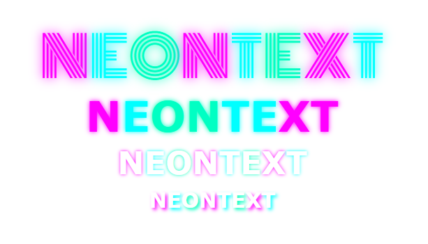

# NeonText
> Give your text a touch of neon.

A colorful neon text generator, that splits the `innerText` of your element into seperate spans and colorizes their `text-shadow` and `color` properties individualy.

## Features

 - :rocket: **zero** dependencies, **tiny** library
 - :boom: available in **multiple formats**  `umd`, `esm` and `cjs`
 - :zap: written in **typescript**

## Installation

### via `npm`

```shell
npm install neontext
```
Afterwards import the library.
```js
import { neonify } from 'neontext'
```
### via `<script>`
Add the following line to your HTML file and adjust the path.
```html
<script src="path/to/neontext.umd.js"></script>
<script>
    neontext.neonify({options})
</script>
```
## Usage

 Given the following HTML markup.
```html
<div id="container">
    Servus,<br>Howdy folks!
</div>
```
 Simply call the `neonify()` function and pass your options within an object.
```js
neonify({ 
    elem: "container", // mandatory
    shadowBlurRadius: 5,
    colors: ["red", "green", "purple"],
    random: true,
    colorizeText: false,
    shadowOffsetX: 0,
    shadowOffsetY: 0,
})
```
The colors will be randomly applied, which will result in:  


## Configuration
The options have to be passed in an object adhering to the following interface:
```js
interface options {
    elem: string;
    colors?: Array<string>;
    blur?: number;
    colorizeText?: boolean;
}
```
#### elem
Type: `String`  
Default: `none`  
Mandatory: `true`

The `id` of the element containing your text.

---
#### colors
Type: `Array<String>`  
Default: `["#ff00ff", "#00ffff", "#ffff00"]`  
Mandatory: `false`

An array containing the CSS color strings, which will be used for coloring the `text-shadow`.

---
#### blur
Type: `Number`  
Default: `5`  
Mandatory: `false`

The blur radius for the `text-shadow`.

---
#### colorizeText
Type: `boolean`  
Default: `false`  
Mandatory: `false`

Sets wether the text color will be colorized aswell.

## Licensing

The code in this project is licensed under MIT license.